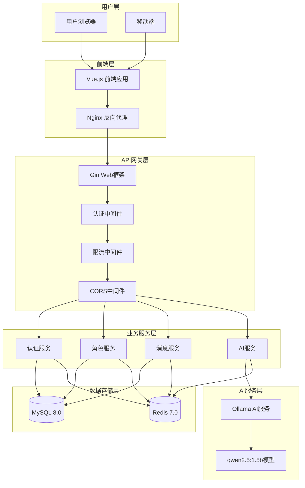
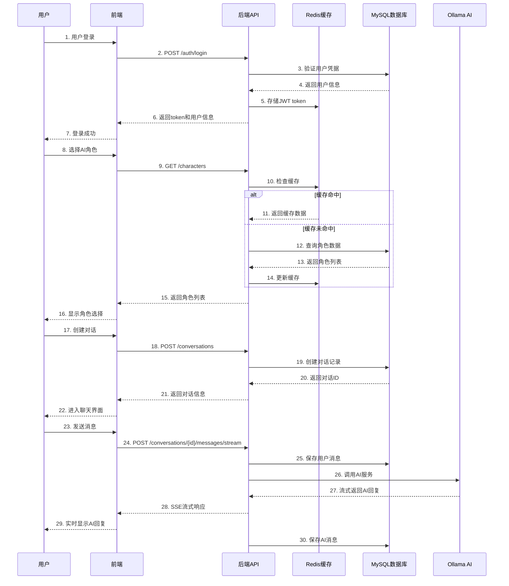
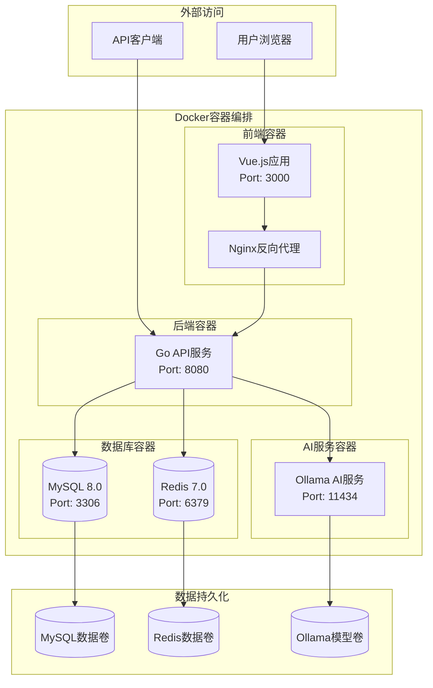
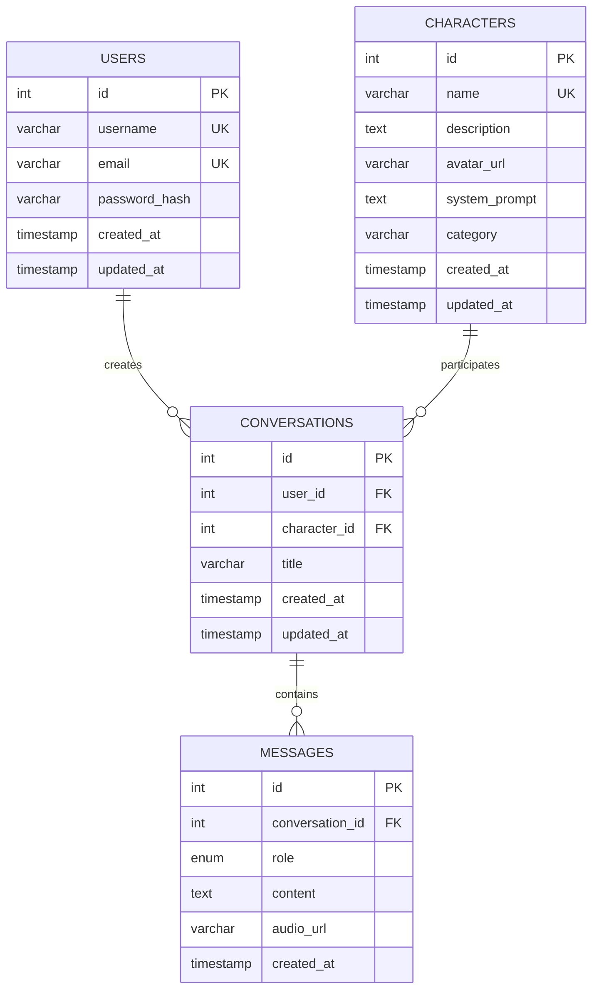
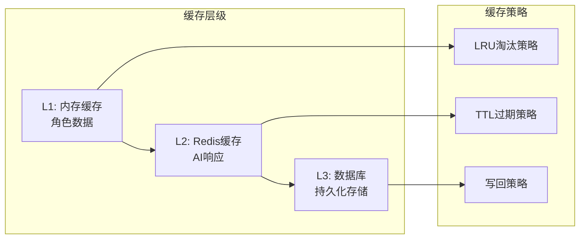

# 🎭 AI角色扮演聊天系统 - 架构设计文档

## 📋 项目概述

AI角色扮演聊天系统是一个基于Web的智能对话平台，用户可以与历史人物、文学角色、科学家等AI角色进行深度对话。系统采用现代化的微服务架构，支持语音交互、实时流式响应和智能缓存优化。

## 🏗️ 系统架构

### 整体架构图



## 🎯 核心功能模块

### 1. 用户认证模块
- **JWT认证**：基于JWT的无状态认证机制
- **会话管理**：Redis存储用户会话信息
- **安全中间件**：请求认证和权限验证

### 2. 角色管理模块
- **角色库**：预置历史人物、文学角色、科学家等
- **角色搜索**：支持按名称、类别搜索角色
- **角色详情**：包含头像、描述、系统提示词等

### 3. 对话管理模块
- **会话创建**：用户与AI角色创建对话会话
- **消息存储**：用户消息和AI回复的持久化存储
- **对话历史**：完整的对话记录管理

### 4. AI对话模块
- **智能回复**：基于Ollama大语言模型的智能对话
- **流式响应**：实时流式输出AI回复内容
- **缓存优化**：AI响应智能缓存，提升响应速度

### 5. 语音交互模块
- **语音输入**：支持实时语音转文字
- **语音输出**：AI回复可转换为语音播放
- **多语言支持**：支持多种语言的语音识别

## 🔄 数据流图



## 🐳 部署架构图



## 🛠️ 技术栈详解

### 前端技术栈
| 技术 | 版本 | 用途 | 优势 |
|------|------|------|------|
| **Vue.js** | 3.3.4 | 前端框架 | 响应式数据绑定，组件化开发 |
| **Vite** | 4.4.9 | 构建工具 | 快速热重载，现代化构建 |
| **Tailwind CSS** | 3.3.3 | CSS框架 | 原子化CSS，快速样式开发 |
| **Pinia** | 2.1.6 | 状态管理 | Vue 3官方推荐的状态管理 |
| **Vue Router** | 4.2.4 | 路由管理 | 单页面应用路由控制 |
| **Axios** | 1.5.0 | HTTP客户端 | 异步请求处理 |

### 后端技术栈
| 技术 | 版本 | 用途 | 优势 |
|------|------|------|------|
| **Go** | 1.23+ | 编程语言 | 高性能，并发处理能力强 |
| **Gin** | 最新 | Web框架 | 轻量级，高性能HTTP框架 |
| **MySQL** | 8.0 | 关系数据库 | 事务支持，数据一致性 |
| **Redis** | 7.0 | 缓存数据库 | 高性能缓存，会话存储 |
| **JWT** | - | 认证机制 | 无状态认证，安全性高 |
| **Swagger** | - | API文档 | 自动生成API文档 |

### AI技术栈
| 技术 | 版本 | 用途 | 优势 |
|------|------|------|------|
| **Ollama** | 最新 | AI服务 | 本地化部署，数据隐私保护 |
| **qwen2.5:1.5b** | 1.5B参数 | 语言模型 | 轻量级，响应速度快 |

## 📊 数据库设计

### 核心数据表



### 缓存策略



## 🔒 安全架构

### 认证与授权
- **JWT Token**：无状态认证，支持分布式部署
- **Redis会话**：会话信息缓存，支持集群部署
- **中间件保护**：请求认证、权限验证、限流控制

### 数据安全
- **密码加密**：bcrypt哈希加密存储
- **SQL注入防护**：参数化查询，ORM保护
- **XSS防护**：输入验证，输出转义
- **CSRF防护**：同源策略，Token验证

### API安全
- **限流控制**：防止API滥用，保护系统稳定
- **CORS配置**：跨域请求控制
- **HTTPS支持**：数据传输加密

## ⚡ 性能优化

### 缓存优化
- **多层缓存**：内存缓存 + Redis缓存 + 数据库
- **智能缓存**：AI响应缓存，减少重复计算
- **缓存预热**：角色数据预加载

### 数据库优化
- **索引优化**：关键字段建立索引
- **查询优化**：分页查询，避免全表扫描
- **连接池**：数据库连接复用

### 前端优化
- **代码分割**：按需加载，减少初始包大小
- **静态资源**：CDN加速，图片压缩
- **响应式设计**：移动端适配优化

## 🚀 部署方案

### Docker容器化部署
```bash
# 一键启动所有服务
docker-compose up -d

# 服务列表
- 前端服务: http://localhost:3000
- 后端API: http://localhost:8080
- Swagger文档: http://localhost:8080/swagger
- MySQL: localhost:3306
- Redis: localhost:6379
- Ollama: localhost:11434
```

### 生产环境部署建议
1. **负载均衡**：Nginx反向代理，多实例部署
2. **数据库集群**：MySQL主从复制，读写分离
3. **缓存集群**：Redis集群，高可用部署
4. **监控告警**：系统监控，性能指标告警
5. **日志管理**：集中化日志收集和分析


## 🔧 开发规范

- **Go代码**：遵循Go官方代码规范
- **Vue代码**：遵循Vue官方风格指南
- **API设计**：RESTful API设计原则
- **数据库**：遵循数据库设计范式


